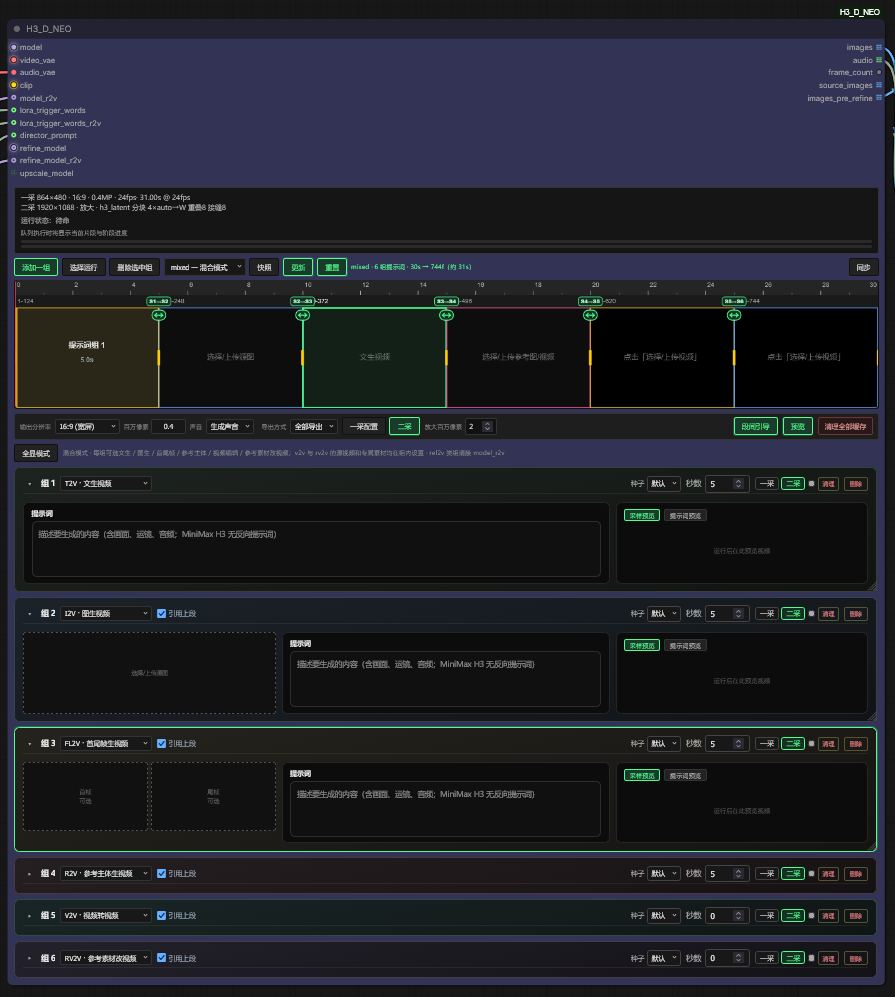

# ComfyUI MiniMax H3 Director

Multi-segment AV timeline director for **official ComfyUI MiniMax-H3**.  
Repository: [AIMixer/ComfyUI_MiniMaxH3_Director](https://github.com/AIMixer/ComfyUI_MiniMaxH3_Director)

**中文文档** → [README.md](README.md)



## Dev updates

Incremental changes versus [`main`](https://github.com/AIMixer/ComfyUI_MiniMaxH3_Director). Features below are unique to this branch; the rest of the document matches main.

### Mixed mode

New `task_type=mixed`. After adding a group, each group can switch type (`t2v` / `i2v` / `fl2v` / `r2v`); behavior matches the original mode. `t2v` / `i2v` / `fl2v` groups use Director `model` (fl2va). `r2v` groups should wire optional `model_r2v` (ref2va); unwired falls back to `model`.

`fl2v` groups accept start-only, end-only, both, or neither (text-to-video). Filling one end does **not** copy that picture onto the other.

### Built-in second pass

Director has in-node second pass; an external Refine node is no longer required. First-pass / second-pass / preview knobs move from native Comfy widgets into the output bar. The three panels are exclusive (only one open at a time):

- **First-pass settings**: seed, steps, sampler, scheduler, `shift_video` / `shift_audio`
- **Second pass**: **Enable second pass** lives inside the panel (off = first pass only; on = groups default to second pass), plus mode / upscale / tiles. In `upscale` / `latent_upscale`, **Upscale megapixels** sits next to the button
- **Preview**: enable, speed, and preview VAE
- Run status shows first- and second-pass canvas plus tiling (e.g. `1st 864×480 · 24fps` / `2nd 1280×720 · upscale · h3_latent`)
- Modes are still `refine` (same-resolution), `upscale` (enlarge then sample), `latent_upscale` (H3 latent enlarge only)
- Built-in defaults: `euler` + `simple`, 3 steps, denoise **0.35**; optional low-sigma extra steps (default +1, cosine, start sigma 0.70)
- Optional ports: `refine_model` (second-pass UNET), `upscale_model` (`upscale` + `lanczos` only), `refine_sigmas` (overrides steps / scheduler / denoise / extra steps when wired)
- **MiniMax H3 Director Refine** still works: a wired pack overrides the in-node widgets (old workflows unchanged)

### LoRA trigger words

Optional `lora_trigger_words` input can be fed by common LoRA nodes. For `r2v` it is appended as a trailing `style_tags:` block so the model does not speak the token at the start of the clip; other tasks still prepend it (e.g. `mh3turbo, <user prompt>`). The group preview column can switch **Sample preview** / **Prompt preview**; the latter shows the full text sent to sampling (including trigger words). First-pass cache fingerprints include the trigger; older caches that baked it into `prompt` still match.

### Per-group first / second pass

With second pass enabled (in-node panel or wired Refine), each group card can pick **pass 1** / **pass 2** (replaces the old global `confirm_first_pass`):

- **Pass 1**: first sample only; skipped on an exact first-pass cache hit
- **Pass 2**: first then second sample; skips to second if a first-pass cache matches
- Click the status dot for per-group match / diff
- **Clear** deletes that group's first-pass cache only
- Group 1 never pins a previous tail, so adding later groups or toggling segment continuity does not bust group 1's first-pass cache
- A first-pass cache hit still pushes a live preview

The Refine panel shows cache status across the full timeline. With segment continuity on, a missing previous segment skips the handoff and continues sampling instead of aborting.

### HD tiled second sample

HD second sample spatially tiles by default to lower DiT VRAM:

- `refine_tile`: tiling on/off (off = full-frame)
- `n_tiles` (default 2; 1 = full-frame)
- `tile_axis` (`auto` = longer latent axis)
- `tile_overlap` (latent-domain overlap; 4–8 recommended)
- If the target-axis latent size is ≤ `max_size_for_no_tile` (default 64, ~480p), tiling is skipped

Audio is not split; matching I2V/FL2V keyframes are cropped per tile. Every sampler step-syncs tile denoise and aligns each tile's RoPE to the full canvas so independently sampled seams do not appear. No extra tiled-sampler custom node is required.

### Preview

- Output-bar **Preview** opens its own panel: enable, speed (0–1; 0 hides, 1 is native 16 fps), preview VAE
- Unified preview on the timeline and group cards; the card preview column can switch **Sample preview** / **Prompt preview**
- Video thumbs lazy-load a first-frame poster
- Second pass previews every step; HD latents are downsampled before TAE so second-pass preview is not more expensive than first pass
- In solo-card layout the preview column grows with the card

### Audio and frame rate

- Audio output (generate / source / mute) is shown by task type: `v2v` / `rv2v` and matching mixed-mode groups can keep source audio
- Audio export is forced onto the 24 fps grid
- Prompt text-box fill is more stable

### Stability

- Segment export releases pixels after each clip is written, lowering memory on long jobs
- Refine target resolution auto-aligns (×32)
- Tail-frame continuity handoff fix; end-only fl2v no longer locks the same picture as the first frame
- New widgets are saved by name so old graphs keep widget values after the Second pass group is inserted
- Between-segment VRAM clear is always on (the old toggle is gone)

## Features

**MiniMaxH3Director** is a single-node director for long-form, multi-segment MiniMax H3 audio–video generation — timeline planning, conditioning, sampling, AV decode, and export in one place. It wraps the official `MiniMaxH3ImageToVideo` / `MiniMaxH3ReferenceToVideo` + `MiniMaxH3SigmaShift` + `KSampler` pipeline with native stereo audio.

### Core capabilities

| Feature | Description |
|---------|-------------|
| **Multi-segment timeline** | Upload video in-node; split, equal-split, smart shot-split (PySceneDetect), append; selectable/deletable split points; visual timeline with thumbs |
| **Task modes** | `t2v`, `i2v`, `fl2v` (first/last frame), `r2v` (reference material groups), `v2v` (video-to-video), `rv2v` (reference-guided source edit) |
| **First/last frame (fl2v)** | Dedicated shot groups: prompt-only (text-to-video), or start and/or end (official FL2VA allows end-only). With segment continuity + From prev, an empty shot pins the previous tail (N context frames) for motion/audio handoff; drag edges for duration; run-select per group |
| **Reference groups (r2v)** | fl2v-style groups: each group has its own images 1–9 / audios 1–3 / videos 1–3 and shot prompt; prompt tags `<Picture N>` / `<Video K>` / `<Audio J>` (or `@` picker); timeline preview synced with card selection |
| **Source-video edit (v2v / rv2v)** | Bernini-style source timeline; each segment bound as `<Video 1>`; `rv2v` adds optional refs (images 1–9, audios 1–3) |
| **Run select** | Sample only checked segments/groups; unselected may use cache or source passthrough when exporting all |
| **External multi-group inputs** | `Director Group (Image to Video)` / `(Reference to Video)` + `Groups Combine`; wire into `i2v_groups` / `r2v_groups` for external-priority batches with run-select |
| **Native stereo audio** | Generated with the picture; `v2v`/`rv2v` can generate / keep source / mute |
| **Segment continuity** | Off by default. For multi-segment `t2v` / `i2v` / `fl2v` / `r2v` / `v2v` / `rv2v`, pin the previous generated tail (motion + generated audio) into the next sample, then trim the prefix. Context frames: 5 / 22 / 39 / 56 — **recommended default: 22**. **Thanks to [ComfyUI-H3-Motion-Context](https://github.com/NikoDemon80/ComfyUI-H3-Motion-Context) for the implementation approach** |
| **Refine / upscale** | Wire **MiniMax H3 Director Refine** into Director `refine`. Unconnected = original single-pass sampling. `refine` = same-resolution second sample; `upscale` = enlarge to a target canvas then SIGMAS sample (pixel / RTX VSR / H3 latent); `latent_upscale` = H3 latent enlarge only, no second sample. `passes` repeats refine (upscale once). Optional `refine_model` swaps the second-pass UNET. `images` is the refined clip; `images_pre_refine` is the first pass (before upscale) |
| **Run report** | `report` output with plan and per-segment summary |
| **Director pack I/O** | Toolbar **Import pack / Export pack**: zip of timeline JSON plus reference images/videos/audio. ASCII folders (`shared_params/`, `asset_groups/01/`, `Picture1`…) match the English UI and avoid path-encoding issues |

Reference-audio slots can select an existing video or a local audio/video file. A video's first audio stream is extracted immediately to FLAC directly under `input/`; local source videos remain temporary and are not saved as video assets. Audio follows ComfyUI's existing upload rule: identical content with the same name is reused, while different content with the same name gets a numeric suffix without overwriting; the same resolved audio path is not added twice within one material group.

### Inputs / outputs

**Inputs:** `model` → `video_vae` → `audio_vae` → `clip`  
**Optional:** `i2v_groups` (Image to Video packs) / `r2v_groups` (Reference to Video packs) / `refine` (`MiniMax H3 Director Refine`)

**Outputs:** `images` → `audio` → `fps` → `frame_count` → `source_images` → `report` → `images_pre_refine`

> CLIP Loader **type must be `minimax`** (Qwen3-VL).  
> Use **fl2va** UNET for `t2v` / `i2v` / `fl2v`; **ref2va** for `r2v` / `v2v` / `rv2v`.

`Export source to source_images` populates only the separate `source_images` output; it does not change `images`. Connect `source_images` to a preview or video compositor. Decode failures are reported explicitly and emit a neutral placeholder instead of generated frames.

## Director pack (script + media)

Toolbar **Import pack / Export pack** writes `*.mmxpack.zip`. Paths are ASCII only and match the English UI (independent of the current UI language).

| English UI | Pack path |
|------|------|
| Global refs (v2v / rv2v) | `shared_params/` |
| Asset group 1 | `asset_groups/01/` |
| Picture 1–9 | `Picture1.png` … `Picture9.webp` |
| Video 1–3 | `Video1.mp4` |
| Audio 1–3 | `Audio1.wav` |
| start / end (fl2v) | `start.jpg` / `end.jpg` in that group folder |
| Upload video (v2v source) | `source_video/` |

```
pack.json
shared_params/shared_params.json
shared_params/Picture1.png
asset_groups/01/group.json
asset_groups/01/Picture1.png
timeline.json
```

- `timeline.json` is written on Director export for lossless round-trip (including other-task drafts).
- A converter may write only `pack.json` + `shared_params/` + `asset_groups/` and omit `timeline.json`.
- Slot numbers match the UI: group `Picture1` is prompt `<Picture 1>` — do not rename slots.
- Models (UNET / CLIP / VAE) are not included. Import replaces the current node timeline (with confirmation). Media is copied to ComfyUI `input/minimax_director_packs/`.

## Requirements

**ComfyUI ≥ v0.30.0** with official MiniMax H3 nodes ([PR #15224](https://github.com/comfyanonymous/ComfyUI/pull/15224), [PR #15228](https://github.com/comfyanonymous/ComfyUI/pull/15228)).

Optional: `scenedetect`, `opencv-python-headless`, `imageio-ffmpeg` — see `requirements.txt`.  
Refine `nvidia_rtx_vsr` needs an NVIDIA GPU: `pip install nvidia-vfx --extra-index-url https://pypi.nvidia.com` (not a hard dependency).

## Installation

### Method 1: Manual (standard)

```bash
cd ComfyUI/custom_nodes
git clone https://github.com/AIMixer/ComfyUI_MiniMaxH3_Director.git

pip install -r ComfyUI_MiniMaxH3_Director/requirements.txt
```

Restart ComfyUI.

### Method 2: ComfyUI Manager

1. Open **ComfyUI Manager**
2. Choose **Install via Git URL**
3. Enter `https://github.com/AIMixer/ComfyUI_MiniMaxH3_Director.git` and install
4. Restart ComfyUI

## Models & workflow downloads

Full pack (**MiniMax H3 weights** + **example JSON workflows**):

**[Comfyit · article 506 — MiniMax H3 models & workflows](https://comfyit.cn/article/506)**

Merge `models/` into `ComfyUI/models/`, then drag a JSON workflow into ComfyUI.

Also available:

- **Hugging Face:** [Comfy-Org/MiniMax-H3](https://huggingface.co/Comfy-Org/MiniMax-H3)
- **ComfyUI docs:** [MiniMax H3 workflows](https://docs.comfy.org/tutorials/video/minimax/minimax-h3)

This repo ships examples under `example_workflows/`:

| Workflow | task_type | UNET | Notes |
|----------|-----------|------|--------|
| `minimax_h3_director_t2v.json` | t2v | fl2va | Text to AV |
| `minimax_h3_director_fl2v.json` | fl2v | fl2va | First/last frame groups |
| `minimax_h3_director_r2v.json` | r2v | **ref2va** | Reference material groups |
| `minimax_h3_director_v2v.json` | v2v | **ref2va** | Source-video timeline edit |
| `minimax_h3_director_rv2v.json` | rv2v | **ref2va** | Source + reference images/audio |
| `minimax_h3_director_external_groups_i2v.json` | fl2v | fl2va | External Group×2 → Combine → `i2v_groups` |
| `minimax_h3_director_external_groups_r2v.json` | r2v | **ref2va** | External Group×N → Combine → `r2v_groups` |
| `minimax_h3_director_二采_加速.json` | r2v | **ref2va** | Refine second sample (SIGMAS + H3 latent); `images` and `images_pre_refine` each save a clip |

### Recommended model files

| Role | Filename | Directory |
|------|----------|-----------|
| UNET (t2v / i2v / fl2v) | `minimax_h3_fl2va_pruned_int8_convrot.safetensors` | `models/diffusion_models/` |
| UNET (r2v / v2v / rv2v) | `minimax_h3_ref2va_pruned_int8_convrot.safetensors` | `models/diffusion_models/` |
| CLIP | `qwen3vl_32b_minimax_h3_nvfp4_awq.safetensors` | `models/text_encoders/` |
| Video VAE | `minimax_h3_video_vae_fp16.safetensors` | `models/vae/` |
| Audio VAE | `minimax_h3_audio_vae_fp32.safetensors` | `models/vae/` |

## Quick start

1. Ensure ComfyUI ≥ **0.30.0** with MiniMax H3 nodes
2. Load an example from [article 506](https://comfyit.cn/article/506) or `example_workflows/`
3. Connect UNET / CLIP / video_vae / audio_vae, edit the timeline UI, Queue

**Video tutorial:** [Bilibili playlist · plugin usage](https://space.bilibili.com/1997403556/lists/8357740)

### Default sampling

- Canvas default **0.4MP 16:9 (864×480)**, **5s / 124** frames @ **24 fps** (17k+5 grid)
- **25** steps, `res_multistep` + `simple`, CFG **1.0**
- Sigma shift: video **12** / audio **3**

### First/last frame (fl2v) — short guide

1. Set task type to **First/Last Frame to Video (fl2v)**
2. Click **Add group**: prompt-only (text-to-video), or upload start and/or end (end-only OK; start-only = i2v)
3. With multiple groups, turn on **Segment continuity** and check **From prev** — an empty shot pins the previous tail (N context frames, default 22)
4. Adjust duration on the shot card or timeline; write mid-shot motion / camera / transition in the prompt
5. Queue; with multiple groups, use **Run select** to sample only some of them

### Reference groups (r2v) — short guide

1. Set task type to **Reference to Video (r2v)** (**ref2va** UNET + audio_vae)
2. Click **Add material group**; write per-shot prompts and attach that group’s images / audio / video
3. In prompts use `<Picture N>` / `<Video K>` / `<Audio J>`, or type `@` to mention group assets
4. Timeline previews group duration/thumbs; Run-select stays in sync with group checkboxes

### Source video (v2v / rv2v) — short guide

1. Choose **v2v** or **rv2v**, upload a source video and split segments (cut / equal-split / smart split)
2. Write a prompt per segment; the source clip is bound as `<Video 1>` automatically
3. For `rv2v`, optionally add reference images / audio; audio mode can be generate / source / mute

### Refine / upscale — short guide

1. Add **MiniMax H3 Director Refine** and wire `refine` into Director `refine`. Leave it unconnected for the original single pass
2. `mode=refine`: same-resolution second sample. `mode=upscale`: enlarge to a target canvas then second-sample. `mode=latent_upscale`: enlarge H3 video latent only (no second sample). Resolution widgets appear for `upscale` / `latent_upscale` (follow Director, aspect + megapixels, or custom W×H). Director canvas is the first-pass size; Refine target is the enlarge size
3. `passes`: refine rounds, default 1, max 9999. In `upscale` mode only the first round enlarges; later rounds stay on that canvas. `latent_upscale` does not sample
4. Optional `refine_model` (second-pass UNET); unwired uses the Director model. Typical: Turbo LoRA on pass 1, a clean / other LoRA UNET on refine
5. Director `images` is the refined clip; `images_pre_refine` is the first pass before upscale (for A/B). `source_images` is still the timeline source, not the first-pass generate. With `confirm_first_pass`, the first queue exposes only `images_pre_refine` and blocks downstream saving from `images`; the next queue outputs `images` after refining the cached first pass
6. Second sample uses SIGMAS: wire `BasicScheduler` or `ManualSigmas` into Refine `sigmas`
7. fl2v skips refine by default (protects pinned first/last frames); turn off `skip_fl2v` on Refine to include those shots
8. Upscale default is `h3_latent`: pick the 3D weights in Refine (dropdown under `upscale_method`; also shown for `mode=latent_upscale`). Put the file in `ComfyUI/models/latent_upscale_models/`. `lanczos` can take optional `upscale_model` (RealESRGAN etc.); or use `nvidia_rtx_vsr`
9. Segment export with `passes>1` also writes `seg_XXXX_pN.mp4` per round; export-all still only keeps first-pass and the final clip

Example: `example_workflows/minimax_h3_director_二采_加速.json`

### External multi-group wiring

Mirror the two official conditioning nodes and feed **multi-group** batches into the Director:

1. Add **`MiniMax H3 Director Group (Image to Video)`** or **`(Reference to Video)`**
2. Wire per group: `prompt` / `duration_sec`; I2V family uses `first_frame` / `last_frame` (none=t2v, first only=i2v, last only or both=fl2v); R2V uses Autogrow slots (same as official Reference to Video: images ≤9, videos ≤3, audios ≤3). Output size is set on the **Director**
3. Batch with **`Director Groups Combine`** (Autogrow slots, same UX as official Reference to Video) → Director `i2v_groups` / `r2v_groups`; a single `group` can connect to the Director directly
4. Match `task_type` to the port (t2v/i2v/fl2v ↔ `i2v_groups`; r2v ↔ `r2v_groups`); do not connect both ports at once
5. When linked, graph wiring overrides UI cards (external priority); Run-select still applies by group index

## Ecosystem · [Comfyit](https://comfyit.cn/)

[Comfyit](https://comfyit.cn/) provides environment, models, workflows, and tutorials:

| Resource | Link |
|----------|------|
| Models & workflows pack | [comfyit.cn/article/506](https://comfyit.cn/article/506) |
| Official MiniMax H3 docs | [docs.comfy.org · MiniMax H3](https://docs.comfy.org/tutorials/video/minimax/minimax-h3) |
| Plugin video tutorials | [Bilibili playlist](https://space.bilibili.com/1997403556/lists/8357740) |
| Product center | [comfyit.cn/products](https://comfyit.cn/products) |
| Plugins | [comfyit.cn/plugins](https://comfyit.cn/plugins) |
| Models | [comfyit.cn/resources/models](https://comfyit.cn/resources/models) |
| Workflows | [comfyit.cn/workflows](https://comfyit.cn/workflows) |

## Contact

| | |
|---|---|
| **Maintainer** | [AIMixer](https://github.com/AIMixer) |
| **Repository** | [github.com/AIMixer/ComfyUI_MiniMaxH3_Director](https://github.com/AIMixer/ComfyUI_MiniMaxH3_Director) |
| **Sibling plugin** | [ComfyUI_Bernini_Director](https://github.com/AIMixer/ComfyUI_Bernini_Director) |
| **Author QQ** | **3697688140** |
| **Bilibili** | [space.bilibili.com/1997403556](https://space.bilibili.com/1997403556) |
| **Plugin tutorials** | [Bilibili playlist · usage](https://space.bilibili.com/1997403556/lists/8357740) |
| **QQ groups** | **551482703** · **425064221** · **559826331** |
| **Comfyit** | [comfyit.cn](https://comfyit.cn/) |

## Credits

- [Comfy-Org / ComfyUI](https://github.com/Comfy-Org/ComfyUI) — official MiniMax H3 support
- [MiniMax-AI](https://github.com/MiniMax-AI) — MiniMax H3 model
- [Comfy-Org/MiniMax-H3](https://huggingface.co/Comfy-Org/MiniMax-H3) — weights & docs
- [NikoDemon80/ComfyUI-H3-Motion-Context](https://github.com/NikoDemon80/ComfyUI-H3-Motion-Context) — inspiration for cross-segment motion/audio continuation
- [LBH-123-AI/Comfyui_Minimax_h3_latent_Upscaler](https://github.com/LBH-123-AI/Comfyui_Minimax_h3_latent_Upscaler) — H3 3D latent upscaler architecture and checkpoint format

## License

Apache-2.0
